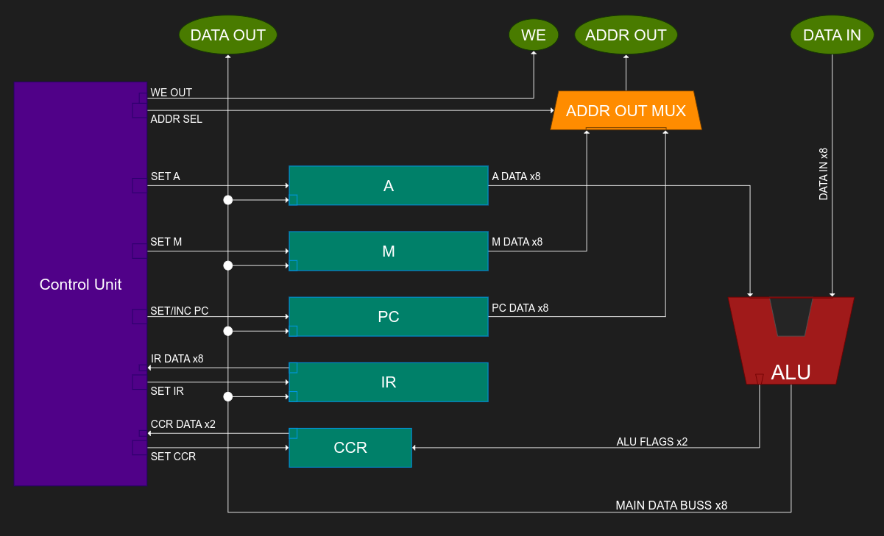

<!---

This file is used to generate your project datasheet. Please fill in the information below and delete any unused
sections.

You can also include images in this folder and reference them in the markdown. Each image must be less than
512 kb in size, and the combined size of all images must be less than 1 MB.
-->

## How it works

The Minibyte CPU is a simple "toy" 8 bit CPU that supports a custom RISC instruction set.

### Specs

Max CLK Frequency: 50Mhz (untested)

Data Buss Width:    8 bits
Address Buss Width: 8 bits (only 7 bits usable due to IO limitations)

Registers:
    A   - 8 bits wide - Accumulator
    M   - 8 bits wide - Memory Address Pointer
    PC  - 8 bits wide - Program Counter
    IR  - 8 bits wide - Instruction Register
    CCR - 2 bits wide - Condition Code Register

Number of Instrucitons: 36

ALU:
    Data Inputs: 2x 8 bit inputs
    Data Output: 8 bits (result) + 2 bits (flags)

    Operations Suported:
        PASSA - Passthrough input A
        PASSB - Passthrough input B
        ADD   - Add A and B
        SUB   - Subtract B from A
        AND   - Logical and of A, B
        OR    - Logical or of A, B
        XOR   - Logical xor of A, B
        LSL   - Logical shift A left by B
        LSR   - Logical shift A right by B
        ASL   - Arithmetic shift A left by B
        ASR   - Arithmetic shift A right by B
        RSL   - Rotatary shift A left by B
        RSR   - Rotatary shift A right by B

### Pinout

PINOUT DESC HERE

### Architecture

The Minibyte CPU uses a very traditional register/memory architecture

Note that DFT and testing features are not represented in the above block diagram

### Instruction Set

IR OPCODE TABLE HERE

### DFT Features

DFT BITS HERE

## How to test

### Simulation

The Minibyte CPU has fairly exhaustive cocotb test suite that is able to test and verify most instrucitons and functionality.

To run the test suite, cd into the ./test directory of the project and run "make"

IMAGE HERE

### On Live Silicon

The easiest way to test the Minibyte CPU on live silicon is to use one of the built-in demo roms

DEMO ROMS DESC HERE

## External hardware

List external hardware used in your project (e.g. PMOD, LED display, etc), if any

SHOW EXAMPLE HW